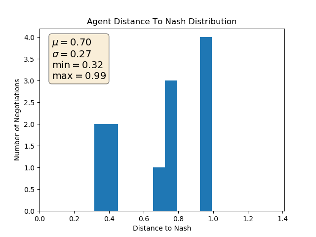
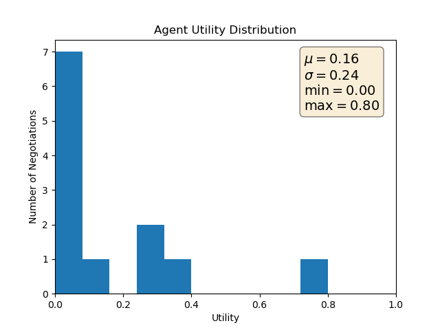
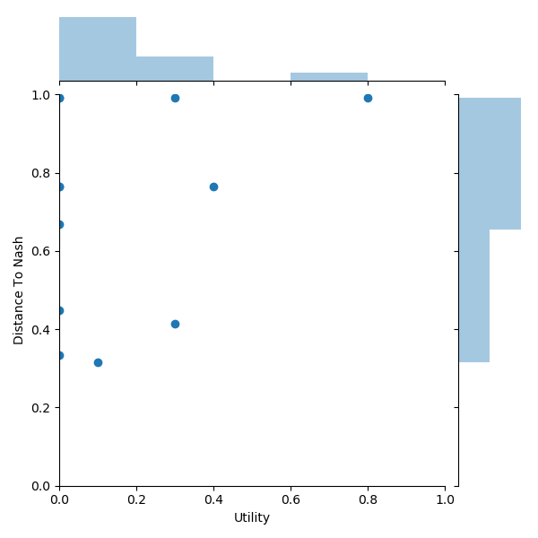
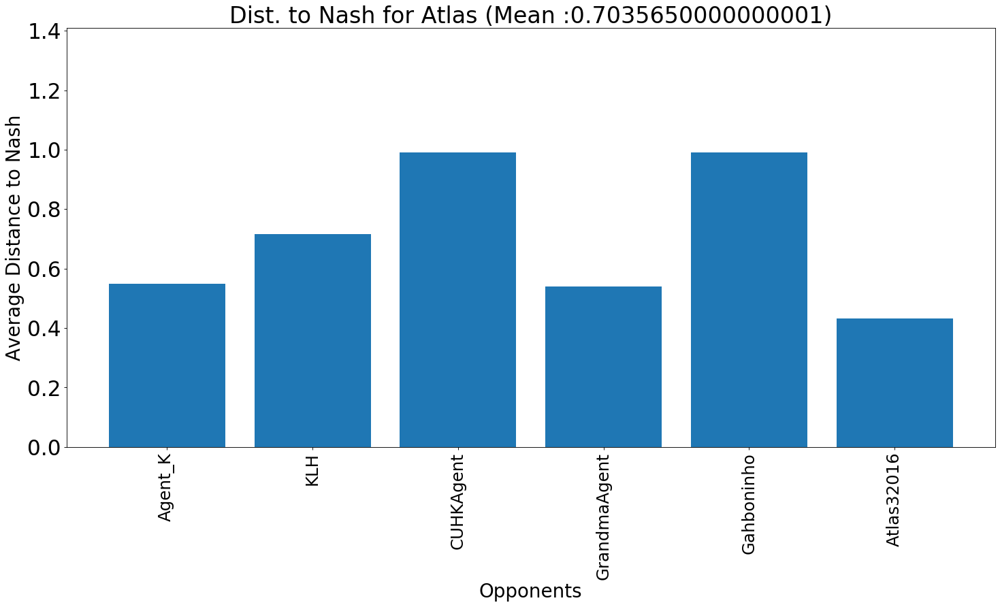
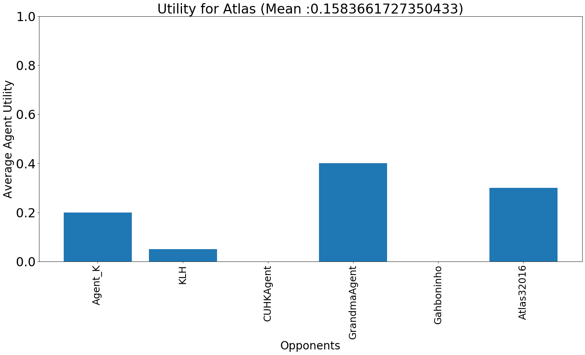

# Tournament Report 

## Key Statistical Results 
Agreements Reached: 
Yes    8
No     4
Name: Agreement, dtype: int64

Agreement rate: 66.66666666666666%

Number of matches won by Atlas: 1

Winning Rate: 8.333333333333332%

Overall score: 0.03129685094314171

Percent Error between Perceived Utility and Actual Utility: 50.332%

Used Domains: ['u_laptop_util1.xml' 'u_laptop_util2.xml']

## Data Visualization 

